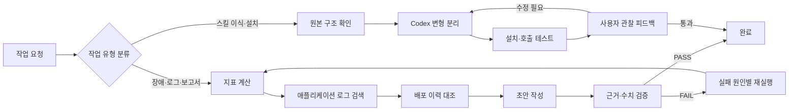

# Cross-session Workflow Harvest

## 분석 범위

Codex가 이 저장소를 작업 디렉터리로 사용한 세션 3개를 분석했다.

- 세션 원본: `/Users/jaegyu.lee/.codex/sessions/2026/08/03/*.jsonl`
- 선별 기준: `session_meta.cwd == /Users/jaegyu.lee/Project/loop-engineering-labs`
- 제외: 다른 프로젝트 세션, archived 세션, 플러그인 캐시, Ouroboros 테스트 trace

세션 수가 아직 3개뿐이므로 반복률은 “현재 관측된 작업 습관”이지 일반 법칙이 아니다.
반복률이 높은 흐름은 바로 workflow 후보로 만들고, 한 번만 나타난 흐름은 다음 세션에서 재검증한다.

## 반복 패턴

| 패턴 | 관측 세션 | 반복률 | 판정 |
|---|---:|---:|---|
| `metrics.jsonl` 지표 계산 → `app.log` 검색 → `deploys.log` 대조 | 3/3 | 100% | 기본 조사 workflow로 승격 |
| postmortem 초안 작성 → 결과 검증 | 2/3 | 67% | 조사 workflow의 후반부로 결합 |
| Claude 스킬 구조 확인 → Codex 변형 분리·설치·실행 확인 | 2/3 | 67% | Codex 스킬 포팅 workflow로 분리 |
| 사용자가 `다음 step`을 주고 한 단계씩 진행 | 2/3 | 67% | 대화형 실행 모드로 채택 |
| tool trace를 읽고 workflow로 승격하는 dreaming | 1/3 | 33% | 후보 상태, 2회 이상 재확인 필요 |

## 관측된 공통 흐름

## 추출할 workflow

### 1. evidence-first-postmortem — 기본 workflow

트리거: 장애 분석, 로그 분석, postmortem, 원인 규명, 지표 이상.

`metrics.jsonl`의 최대값을 먼저 계산하고, `app.log`의 오류·배포·롤백 행을 찾은 뒤,
`deploys.log`로 설정 변경과 롤백을 대조한다. 그 다음에만 문서를 작성한다.

완료 게이트:

- 지표의 값과 시각이 원본과 일치한다.
- p95 최대와 오류율 최대를 하나의 시각으로 뭉개지 않는다.
- 보고서의 모든 `app.log`·`deploys.log` 행 인용이 실제 행이다.
- 영향·타임라인·원인·근거 섹션이 모두 있다.

### 2. skill-port-and-validate — 조건부 workflow

트리거: Claude Code 스킬을 Codex에서 사용, 스킬 설치, Codex용 변형, `/loop`.

원본 스킬의 실행 환경 의존성을 찾고, Claude 전용 파일은 유지한 채 Codex 변형을 별도 경로에 만든다.
설치 후 실제 호출을 한 단계씩 실행하고, 사용자가 관찰한 문제를 다음 변형에 반영한다.

완료 게이트:

- 원본 스킬 파일이 보존된다.
- Codex용 `SKILL.md`의 tool 이름과 로그 방식이 Codex 환경에 맞다.
- 설치 경로에서 실제 호출이 가능하다.
- 설치 성공만으로 끝내지 않고 최소 1회 실행 검증을 한다.

### 3. stepwise-observability — 실행 모드

트리거: 사용자가 `다음 step`, `계속`, `tail 켜짐`처럼 단계 진행을 명시하거나,
실습·교육·tool call 관찰을 요청할 때 활성화한다.

한 번에 한 작업만 실행하고, 실행 전 목적·도구·대상을 알린다. 결과를 받은 뒤 파일명·행 번호·숫자를
짚고 멈춘다. 이 모드는 작업 내용 자체보다 실행 과정을 관찰하게 하는 것이 목적이다.

## 승격 규칙

새 workflow는 다음 조건을 모두 만족할 때만 자동 후보로 올린다.

1. 서로 다른 세션 2개 이상에서 같은 목적의 행동 순서가 나타난다.
2. 각 세션에서 최소 3개의 행동이 같은 순서로 반복된다.
3. 산출물 또는 검증 게이트가 명확하다.
4. 단순한 환경 설정·실패 복구·도구 사용 설명은 반복 패턴에서 제외한다.

현재 `evidence-first-postmortem`, `skill-port-and-validate`, `stepwise-observability`가 이 기준을 통과한다.
`dreaming`은 다음 세션에서 한 번 더 확인될 때 승격한다.

## 다음 수집에서 볼 것

- 같은 조사 순서가 다른 장애 데이터나 다른 저장소에서도 재현되는가
- 초안 작성 전에 항상 source map을 만드는가
- 검증 실패 후 어느 단계로 되돌아가는가
- 사용자가 단계형 진행을 원하지 않을 때도 관찰 모드를 강제해야 하는가
- workflow 후보가 실제로 호출 가능한 skill·script·seed 중 어느 형태가 되는가
